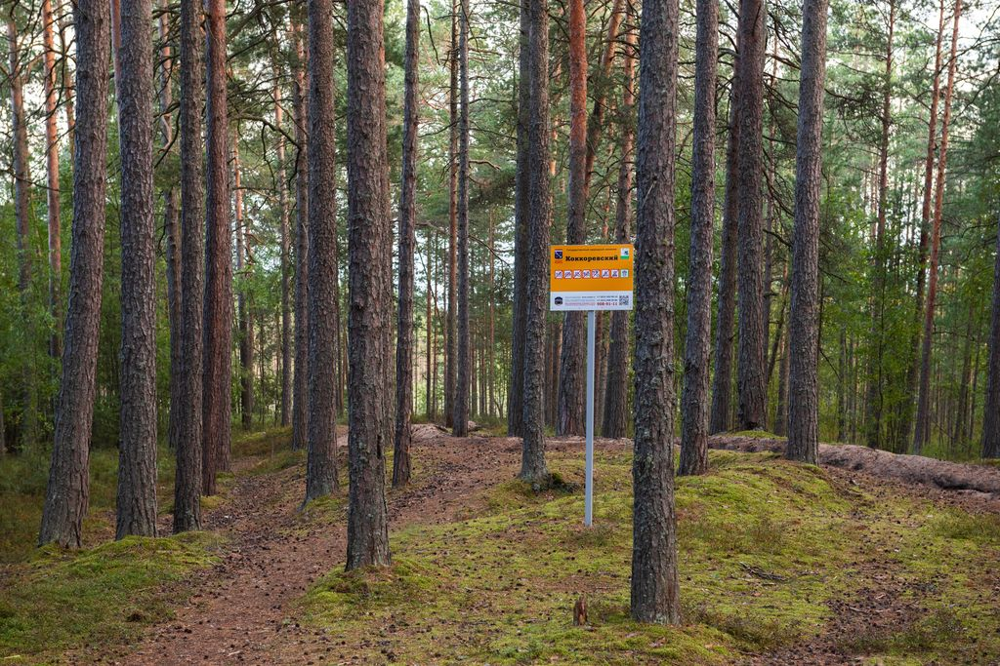
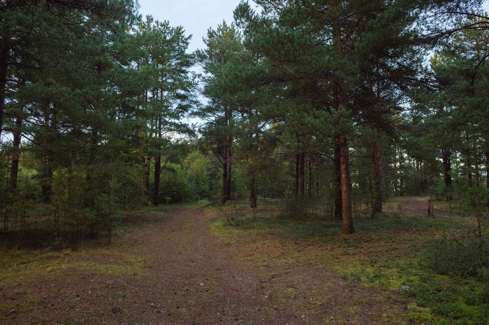
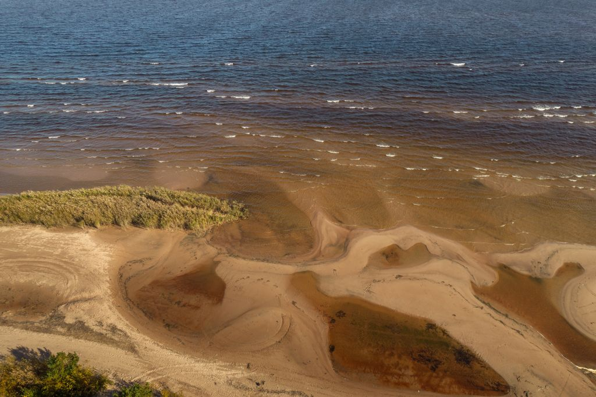
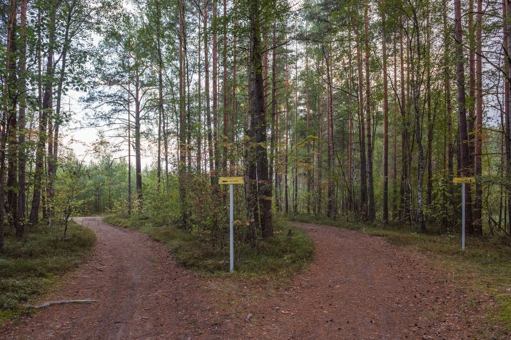
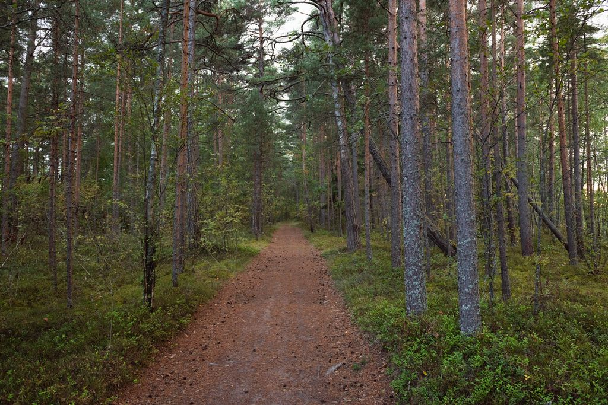
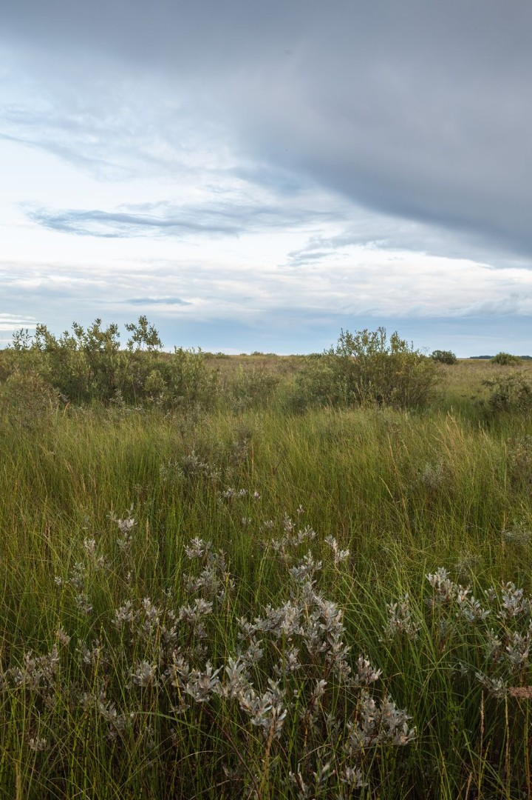
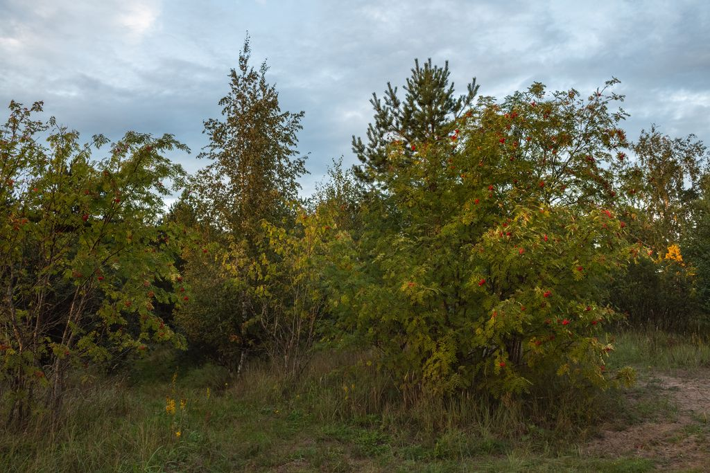
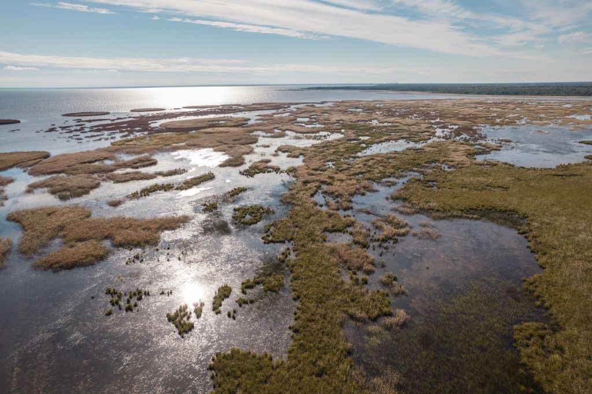
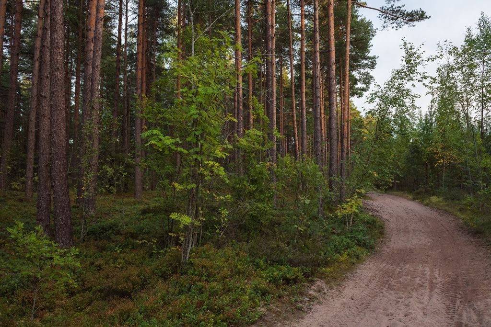
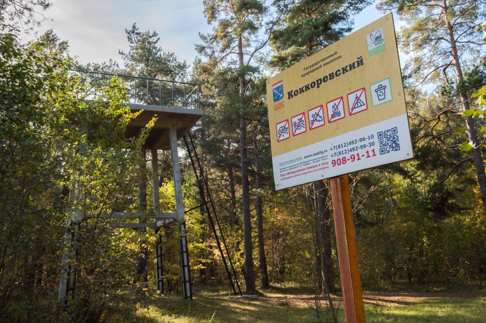

# Мы там были осенью, соу соу

# Ладожские берега

### [Карта](https://yandex.ru/maps/org/peshekhodny_ekologicheskiy_marshrut_ladozhskiye_berega/16365417059/)

**Сколько км тропа:** 5,7 км (кольцевой маршрут, ~1,5 часа пешком)

**Сколько ехать до тропы от метро «Чёрная речка» до начала тропы на машине:** ~70–80 минут без пробок (~61 км) до парковки + ещё ~2,2 км пешком до начала тропы. Маршрут: КАД → Мурманское / Новоприозёрское шоссе → дер. Коккорево, парковка у бывшего пионерлагеря «Ладожец».

---

## Коротко

Экотропа в заказнике «Коккоревский» (Всеволожский район). Кольцевой маршрут через сосновый бор к мысу Сосновец, Коккоревскому болоту и берегу Ладожского озера. Семь информационных щитов, виды на болото и воду, остатки фортификаций ВОВ (оборона «Дороги жизни»).

## Как добраться

| Способ | Детали |
|--------|--------|
| **На машине** | Парковка: `60.048149, 31.093704` (бывший лагерь «Ладожец»). Начало тропы: `60.043026, 31.103915` — от парковки ~2,2 км пешком по лесной дороге или вдоль берега Ладоги |
| Автобус | От Всеволожска (уточнять расписание) |

## Что посмотреть

- Сосновый бор на песчаных грядах
- Коккоревское болото и панорама Ладожского озера с мыса Сосновец
- Фортификационные сооружения 1941–1943 гг.
- Редкая прибрежная и болотная растительность

## Важно знать

- **Бесплатно**, сезонный маршрут: март–ноябрь, лучшее время — июнь–август
- Грунтовые лесные дороги, после дождя — лужи
- Настилов нет, нужна обувь для леса
- На ООПТ действуют стандартные правила: не сходить с тропы, не разводить костры

## Видео

[Ссылка](https://drive.google.com/file/d/10J8BbjweImWcrrU7lJ3UPIsfk0BYYIG7/view?usp=drive_link)

## Фото

## Источники

- [Официальная страница маршрута — ВООП ЛО](https://www.ooptlo.ru/ekologicheskij-marshrut-v-zakaznike-kokkorevskij.html)
- [Отчёт с координатами — polesam.ru](https://polesam.ru/ecotropy)
