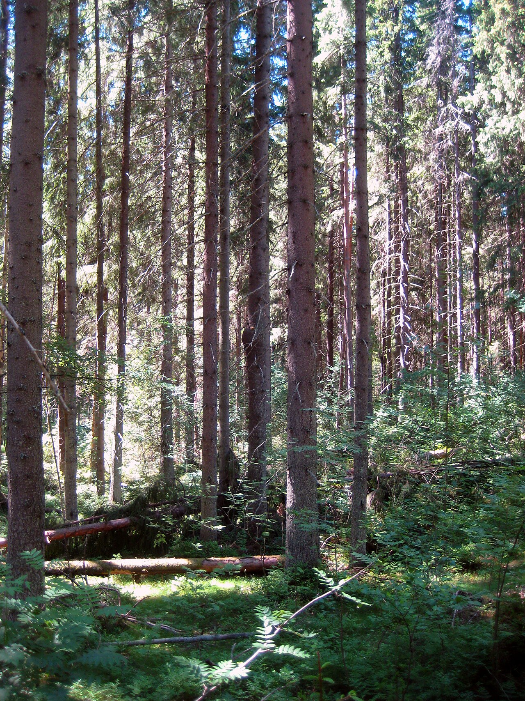
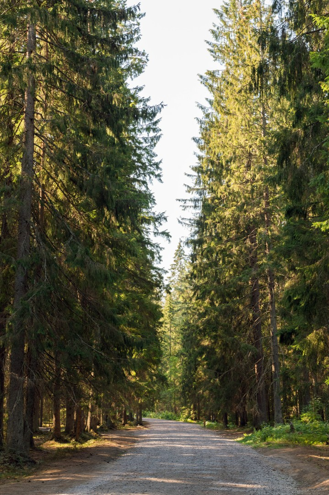
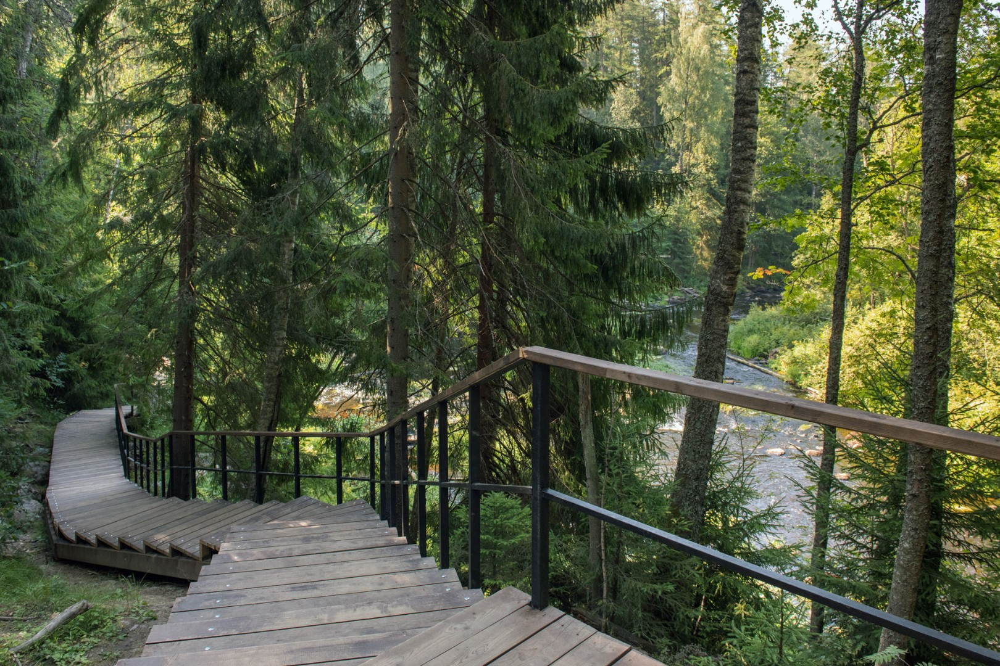
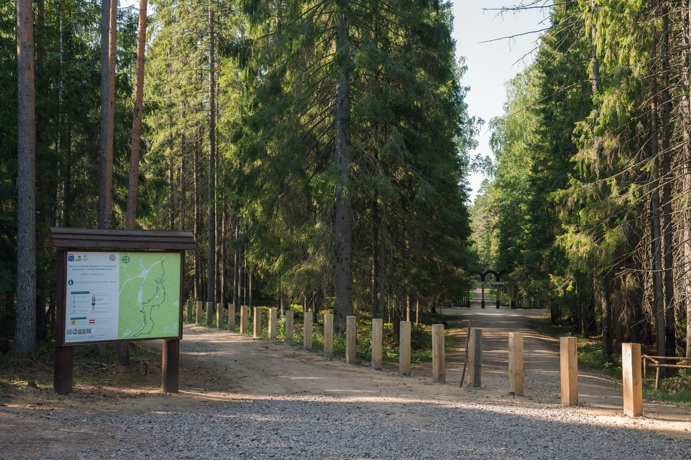
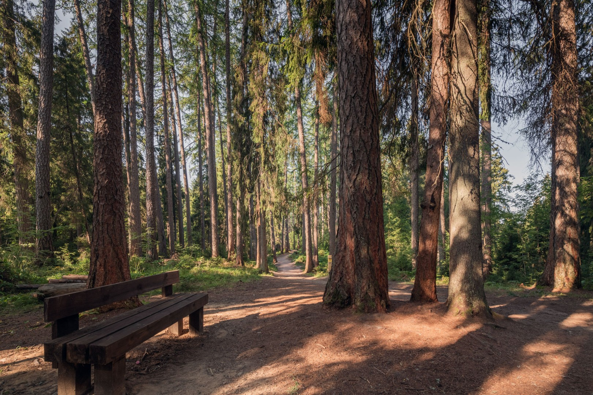
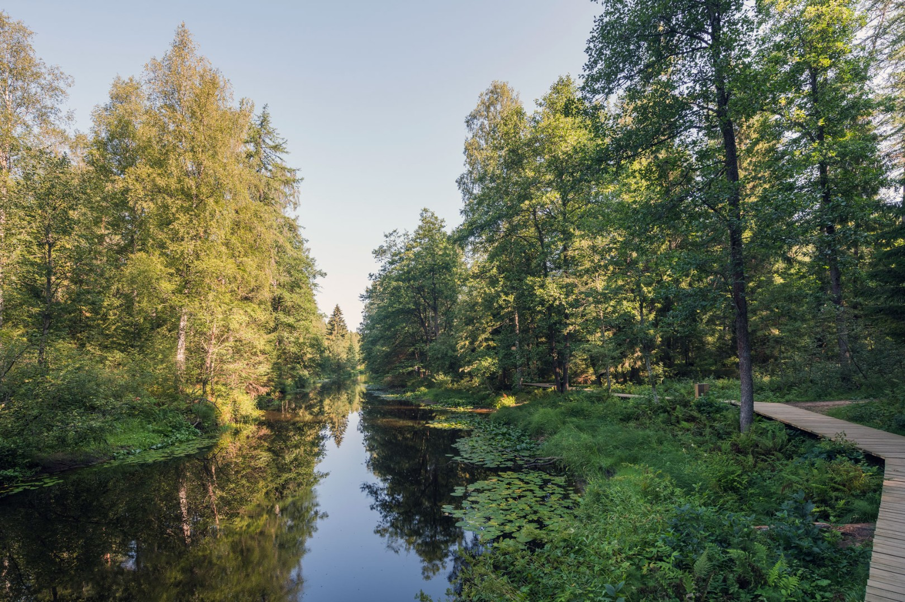
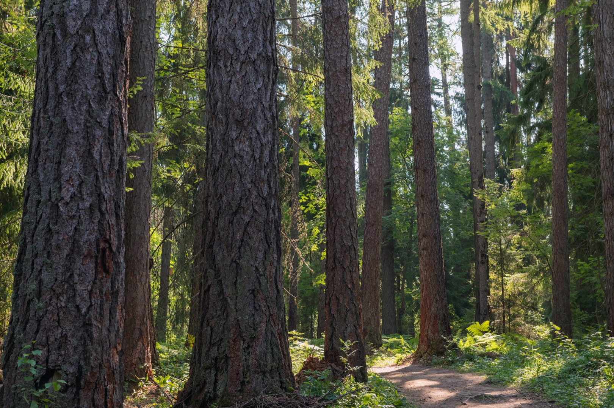
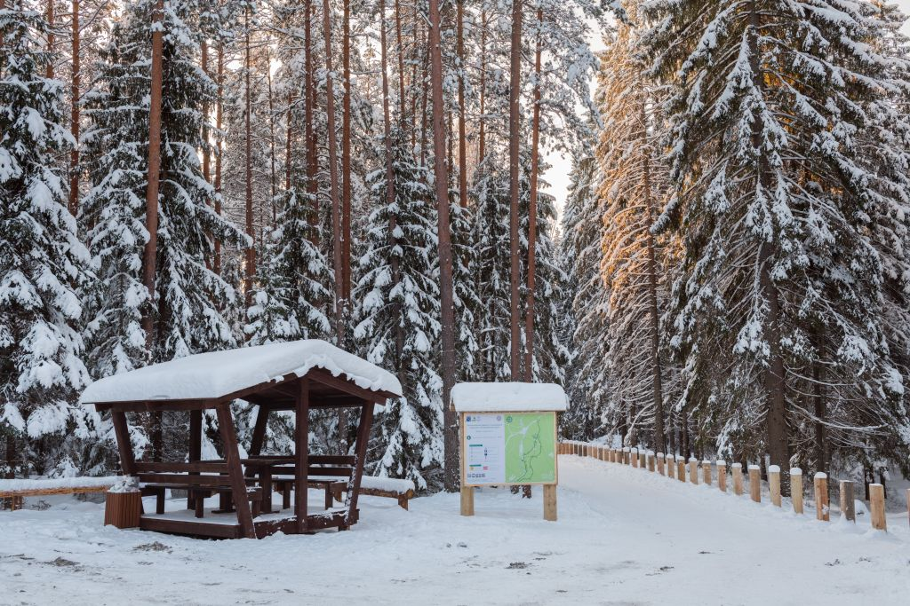
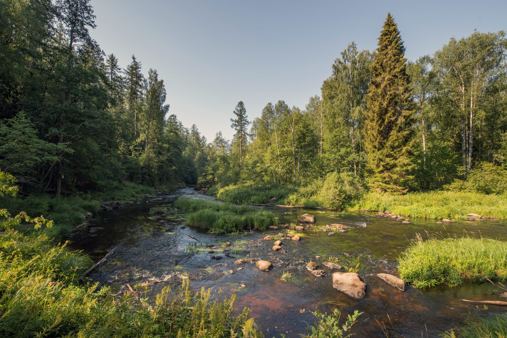
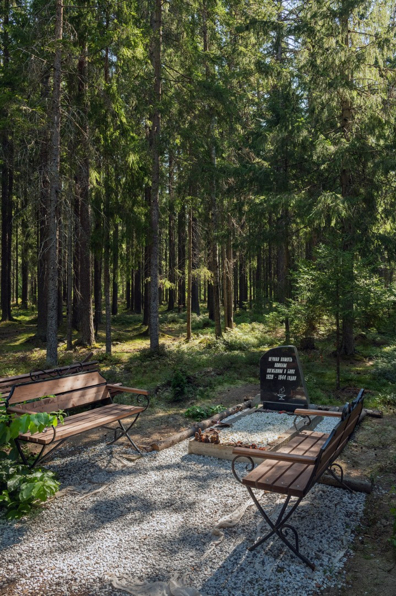

# !Мы там были зимой! (Я бы летом зачекал еще разок)
### [Карта](https://yandex.ru/maps/org/peshekhodny_ekologicheskiy_marshrut_listvennichnaya_roshcha/53998736590/?ll=29.547652%2C60.240096&z=14.85)

# Линдуловская роща (экотропа «Лиственничная роща»)

**Сколько км тропа:** 5,5 км (кольцевой маршрут, ~1,5–2 часа пешком)

**Сколько ехать до тропы от метро «Чёрная речка» до начала тропы на машине:** ~55–65 минут без пробок (~61 км). Маршрут: ЗСД → Приморское / Зеленогорское шоссе → пос. Рощино → ул. Сухотского → парковка у входа в заказник.

---

## Коротко

Одна из лучших оборудованных экотроп Ленобласти. Кольцевой маршрут через старейшую в Европе лиственничную рощу (посадки 1738 года, объект ЮНЕСКО) вдоль бурной реки Рощинки. Деревянные настилы, лестницы с перилами, смотровые площадки, беседки, информационные стенды.

## Как добраться

| Способ | Детали |
|--------|--------|
| **На машине** | Навигатор: `60.238175, 29.540305` (парковка у входа). Начало тропы: `60.242158, 29.540576` |
| Электричка | Финляндский вокзал → ст. Рощино (~30–55 мин), далее ~3 км пешком по ул. Сухотского |
| Автобус | № 680 от м. «Проспект Просвещения» до «Станция Рощино» |

## Что посмотреть

- Вековые лиственницы (сибирская, архангельская, камчатская, европейская)
- Река Рощинка с горным течением
- Туя гигантская (интродуцент из Северной Америки)
- Гигантские муравейники у входа
- Мемориал «Братское захоронение» (1944 г.)

## Важно знать

- **Платный вход:** 200 ₽ (граждане РФ), 400 ₽ (иностранцы). Оплата по QR на стендах
- Круглый год, лучшее время — май, август–сентябрь
- После дождя возможна грязь на грунтовых участках
- WC у входа, кафе — в пос. Рощино
- Собак, велосипеды и самокаты — нельзя

## Видео

[Ссылка](https://drive.google.com/file/d/1lcvgWPuVqYijaYv8Fl1xnTCiuABnnZnc/view?usp=drive_link)

## Фото

## Источники

- [Официальная страница маршрута — ВООП ЛО](https://www.ooptlo.ru/ecolindulovskaya-roshha.html)
- [Экотропа на eco-trails.ru](https://eco-trails.ru/catalog/lenoblast/listvennichnaya-roscha/)
